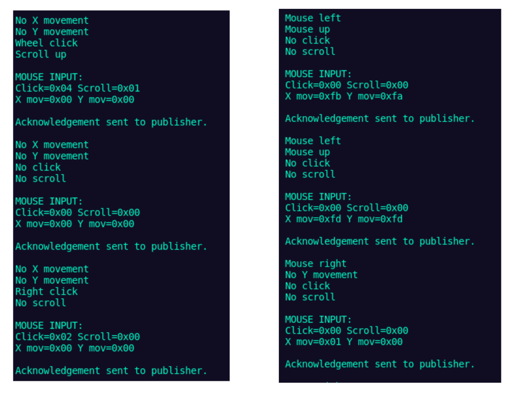

Internet of Things (Fall 2020), MQTT Midterm Project
====================================================

For an overview of the project, read [the project writeup](https://github.com/haasr/mqtt_mouse_dashboard/blob/master/HaasR-4677-901-midterm-project.pdf).

In this project, I was tasked to acquire a USB mouse or game controller, study
the outputs of the device to identify what each byte indicates, and then create
two MQTT components.

The first component is the Node.js client (in mqtt_broacast_mouse) which transmits the bytes when any event is registered by the mouse (a click, scroll, or X/Y movement).

The second component (in mqtt_display_mouse) is a dashboard which correctly interprets the bytes received from the MQTT broker. You will
note I actually have two dashboards: one is a boring text-based Node dashboard
because I was required to use Node.js for my grade; the other is a rudimentary
Python tkinter dashboard which maps where action is happening on an image of a
mouse.

